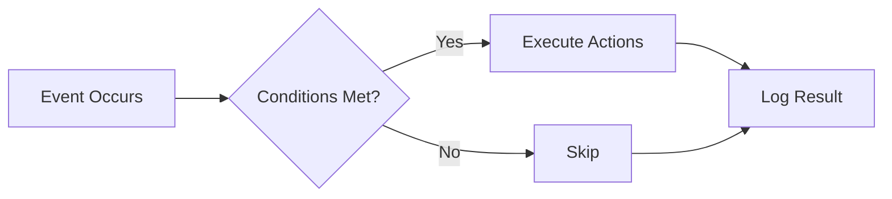

# Automations

Automate repetitive tasks and workflows in your agency. Set up rules that trigger automatically when specific events happen — no coding required.

---

## How Automations Work

Each automation follows a simple pattern:

**When** something happens (trigger) → **If** conditions are met → **Then** do something (action)

For example:
> *When a task status changes to "Done" → If the project is "Website Redesign" → Then send a notification to the project lead.*

---

## Creating an Automation

Navigate to **Automations** in the sidebar and click **"New Automation"**.

The visual builder lets you configure:

Give your automation a descriptive name

Select what event starts it

Optionally narrow down when it runs

Configure what happens when it fires

### Automation Status

| Status | Meaning |
|--------|---------|
| **Active** | Running and monitoring for trigger events |
| **Paused** | Exists but won't fire until reactivated |

Toggle automations on/off at any time without deleting them.

---

## Available Triggers

| Trigger | Fires When |
|---------|-----------|
| **Task Status Changed** | A task moves to a new status |
| **Task Created** | A new task is created |
| **Task Completed** | A task is marked as Done |
| **Invoice Created** | A new invoice is created |
| **Invoice Paid** | An invoice receives full payment |
| **Invoice Overdue** | An invoice passes its due date |
| **Project Created** | A new project is created |
| **Project Completed** | A project is marked as Completed |
| **Comment Added** | A new comment is posted |
| **Client Created** | A new client organization is added |
| **Client Status Changed** | A client's pipeline status changes |
| **Member Joined** | A new team member joins the workspace |

---

## Conditions

Add conditions to make automations more precise. All conditions must pass (**AND logic**) for the automation to fire.

### Supported Operators

| Operator | What It Does |
|----------|-------------|
| **Equals** | Exact match on a field value (e.g., status = "In Review") |
| **Not Equals** | Exclude specific values |
| **Contains** | A text field contains a keyword |
| **In** | Value exists in a list |

---

## Available Actions

| Action | What It Does |
|--------|-------------|
| **Send Notification** | Send an in-app notification to a specific user |
| **Send Email** | Send a branded email to a specified address |
| **Create Task** | Create a new task with specified details |
| **Update Task Status** | Change the triggering task's status |
| **Update Project Status** | Change a project's status |
| **Create Comment** | Add an automated comment to a task or project |
| **Log Activity** | Create an activity feed entry |

### Using Variables

Actions support **dynamic variables** that insert data from the triggering event using `{{variable}}` syntax:

| Variable | Inserts |
|----------|---------|
| `{{title}}` | The task, invoice, or project title |
| `{{status}}` | The current status |
| `{{newStatus}}` | The new status (for status change triggers) |
| `{{assigneeId}}` | The assigned person's ID |
| `{{invoiceNumber}}` | The invoice number |
| `{{companyName}}` | The client company name |
| `{{role}}` | The team member's role (for member joined) |

Any key from the trigger payload can be used as a variable.

---

## Execution Logs

Every automation run is recorded in the execution log:

| Column | Shows |
|--------|-------|
| **Trigger** | What event fired the automation |
| **Status** | Success or Failed |
| **Timestamp** | When it ran |
| **Details** | What conditions were checked and what actions were taken |

Review logs to troubleshoot failed automations or verify that rules are working correctly.

---

## Deferred Triggers

Some actions use **deferred triggers** to handle placeholder data:

- When a **Create Task** action creates a task, the task is initially a placeholder (e.g., title might contain `{{variable}}` syntax)
- Once the triggering event provides the full data, the task is updated with the resolved values
- This ensures tasks created by automations always have accurate, complete information

---

## Plan Limits

Automation counts are governed by your subscription plan:

| Plan | Maximum Automations |
|------|:------------------:|
| **Free** | 0 (not available) |
| **Pro** | 20 |
| **Enterprise** | Unlimited |

When a **Create Task** action fires, the system also checks your task quota. If your plan's task limit has been reached, the action will fail and the execution log will record the reason.

> **See also:** [Settings](./settings/billing#plans--billing) for plan limits

---

## Troubleshooting

### Failed Automations

When an automation fails:
- A **critical notification** is sent to agency owners immediately (bypasses digest and quiet hours)
- The notification is clickable and links directly to the automation editor
- Check the execution log for error details

### Common Issues

| Problem | Solution |
|---------|----------|
| Automation doesn't trigger | Verify the trigger type matches the event, check conditions |
| Action fails | Check that referenced users/projects still exist |
| Too many notifications | Add more specific conditions to reduce false matches |
| Duplicate actions | Review for overlapping automations with similar triggers |

---

## Permissions

| Permission | What It Allows |
|-----------|---------------|
| **View Automations** | See automation list and execution logs |
| **Create Automations** | Create new automation rules |
| **Edit Automations** | Modify existing automations |
| **Delete Automations** | Remove automations |

Available to: Owner, Admin, and Project Manager by default.

> **See also:** [Tasks](./tasks/overview) for task events that trigger automations · [Notifications](./notifications/overview) for notification delivery · [Projects](./projects) for project events
