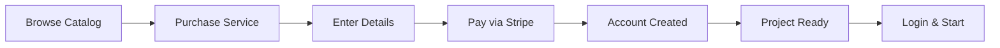

# Client Portal

The client portal gives your clients a dedicated space to view their projects, tasks, invoices, services, and files — all branded with your agency's identity.

---

## What Is the Client Portal?

When you grant a client contact **portal access**, they can log in to your agency's workspace and see information scoped to their organization. They see your agency's branding (logo, colors, fonts) and interact with the platform through a streamlined interface.

Clients access the portal via your workspace URL (`yourslug.eidoncore.com`) or your custom domain (`app.youragency.com`).

> **See also:** [Clients](../clients/overview#portal-access) for how to grant portal access to contacts

---

## Portal Roles

| Role | Display Name | What They Can Do |
|------|-------------|-----------------|
| **Organization Owner** | Client admin | View projects, tasks, invoices, and services. Can comment on tasks, create tasks, and change task statuses. Can view reports |
| **Organization Admin** | Client manager | Same views and capabilities as Organization Owner. Can view reports |
| **Organization Member** | Client viewer | Same views. Can create, edit, and assign tasks. Can add comments. Cannot view reports |

---

## What Clients See

### Client Dashboard

After logging in, clients see a dedicated dashboard showing:

- **Project progress bars** — Visual completion status of each project
- **Task breakdown** — Tasks grouped by status (To Do, In Progress, Done, etc.)
- **Recent invoices** — Latest invoices and their payment status
- **Active services** — Services assigned to their organization

If you've configured a **welcome message** in portal branding, it appears as a banner at the top.

### Sidebar Navigation

Clients see a simplified sidebar:

| Nav Item | Organization Owner | Organization Member |
|----------|:-----------------:|:-------------------:|
| Dashboard | ✓ | ✓ |
| Projects | ✓ | ✓ |
| Tasks | ✓ | ✓ |
| Messages | ✓ | ✓ |
| Services | ✓ | ✓ |
| Cart | ✓ | ✓ |
| Digital Assets | ✓ | ✓ |
| Invoices | ✓ | ✓ |
| My Account | ✓ | ✓ |
| Reports | ✓ | ✗ |
| Settings (Account) | ✓ | ✓ |

You can further customize what clients see by **hiding nav items** in Settings → Agency → Branding → Portal.

---

---

## Client Features

### Projects

Clients can view all projects assigned to their organization:

- Project name, status, and progress
- Task lists within each project
- Milestones and their completion status
- Uploaded files and documents
- Comments and discussions

Organization Owners can **add comments** on projects — these are always visible to the agency team (never internal-only).

### Messages

Clients can participate in real-time messaging:

- **Organization channel** — A shared channel for all organization members to communicate with the agency
- **Project channels** — Chat within each project they're a member of
- **Direct Messages** — Private conversations with agency staff members

Clients can see standard messages but **not internal messages** — agency staff can discuss work privately within shared channels.

Internal messages are never visible to client contacts. Use them for private team discussions within shared project channels.

> **See also:** [Messaging](../messaging) for full messaging features

### Tasks

Clients see tasks in projects assigned to their organization:

- Task title, status, priority, and due date
- Task details and description
- Comments and activity history

Organization Owners can **update task statuses** (e.g., mark as In Review or Done).

### Invoices

Clients can view all invoices billed to their organization:

- Invoice number, amount, status, and due date
- Payment history
- Outstanding balance

### Services

Clients see services assigned to their organization:

- Active, paused, and cancelled services
- Remaining hours or credits balance
- Billing period information
- Linked project (if applicable)

### Files

Clients can access files across all their projects:

- View files uploaded to their projects
- Download files

### Digital Assets

If a client has purchased any **digital products**, a **Digital Assets** page appears in their sidebar. This page shows all purchased products in a table with status, pricing, purchase date, and renewal information.

Clicking a product opens a detail panel where clients can:

- **Download** the product file (when fulfilled and a delivery URL is set)
- **View delivery instructions**
- **Submit an intake form** (if the product has one assigned)
- **Cancel a recurring subscription** with a cancellation reason
- View purchase timeline and cancellation details

> **See also:** [Services](../services/overview#digital-products) for the full digital products feature

### My Account

Clients have a dedicated **My Account** page (in the Finance section of the sidebar) for managing their account:

| Tab | What It Shows |
|-----|--------------|
| **Subscriptions** | Active, paused, and past service subscriptions with status, pricing, billing period, remaining hours/credits, and project links. Cancel subscriptions directly from here |
| **Payments** | Combined spending summary (total spent, invoice payments, service purchases), service purchase history, and invoice payment history |
| **Billing Info** | Organization billing details and saved payment methods (card brand, last 4 digits, expiry) |

When cancelling a subscription, clients select a reason and can add additional details. The agency is notified immediately.

---

## Service Catalog & Purchases

Clients can browse your service catalog and make purchases directly:

### Browsing the Catalog

At `/catalog/services`, clients see:

- **My Active Services** — Services they already have, with remaining hours/credits and a link to the project
- **Available Services** — All published services, organized by category
- **Search and filter** by text, category, or pricing type

### Making a Purchase

1. Click a service to view details (description, deliverables, FAQ, pricing, reviews)
2. Click **"Add to Cart"**
3. Review cart at `/cart`
4. **Checkout** with card, Apple Pay, or Google Pay
5. After payment, a confirmation page shows:
 - Project cards for each purchased service
 - Account manager details
 - "What happens next" steps
 - Intake form (if the service has one)

After purchase, a project is automatically created and immediately visible in the client's project list.

### Saved Payment Methods

During checkout, clients can opt to **save their card** for future purchases. Saved cards are:
- Displayed at checkout for one-click payments
- Visible in **My Account → Billing Info** (card brand, last 4 digits, expiry)
- Used for **automatic recurring billing** on subscription services

Clients can uncheck the "Save card" option during checkout if they prefer a one-time payment.

### Public Catalog (Guest Checkout)

Your service catalog is also accessible to **visitors who don't have an account**:

1. Visitor browses the public catalog at your workspace URL
2. Clicks **"Purchase This Service"** on a service detail page
3. Fills in registration details (company name, name, email, password)
4. Completes payment through Stripe
5. An account, project, and service assignment are **automatically created after payment**
6. Visitor can log in immediately to access their new project

Guest checkout creates the full client setup in one step — no pre-registration needed.

> **See also:** [Services](../services/catalog#cart--checkout-flow) for the full purchase flow from the agency perspective

---

---

## Client Account Management

Clients can manage their account under **Settings → Account**:

### My Account Page

| Feature | Description |
|---------|-------------|
| **Profile** | Update name, avatar, and contact information |
| **Password** | Change password (meets same strength requirements) |
| **Two-Factor Authentication** | Enable/disable 2FA for extra security |
| **Active Sessions** | View and revoke login sessions |
| **Notification Preferences** | Toggle email, digest frequency |

### Subscriptions

If clients have active service subscriptions, they can:

- View their active subscriptions
- See billing period and renewal dates
- **Cancel subscriptions** (with a cancellation reason — the agency is notified)

### Billing Information

Clients can view their saved payment methods and billing details:

- **Saved cards** — Card brand, last 4 digits, and expiry date
- **Organization billing fields** — Read-only view of billing email, address, and tax ID
- Cards are saved automatically when completing a purchase with the "Save card" option enabled

---

## Client Notifications

Clients receive notifications for events relevant to their organization:

| Notification | Organization Owner | Organization Member |
|-------------|:-----------------:|:-------------------:|
| Task assigned | ✓ | ✓ |
| Task status changed | ✓ | ✓ |
| Comments & mentions | ✓ | ✓ |
| Chat @mention | ✓ | ✓ |
| Chat reply | ✓ | ✓ |
| Chat reaction | ✓ | ✓ |
| Invoice sent/updated | ✓ | ✓ |
| Invoice paid | ✓ | ✓ |
| Invoice overdue | ✓ | ✗ |
| Project delayed | ✓ | ✓ |
| Deadline approaching | ✓ | ✓ |
| Project completed | ✓ | ✓ |
| Milestone completed | ✓ | ✓ |
| Contract expiring | ✓ | ✗ |
| Service activated | ✓ | ✓ |

Default notification delivery:
- **Organization Owner** — Instant delivery
- **Organization Member** — Daily digest

> **See also:** [Notifications](../notifications/overview) for full notification details · [Settings](../settings/overview#notification-preferences) for preference management
