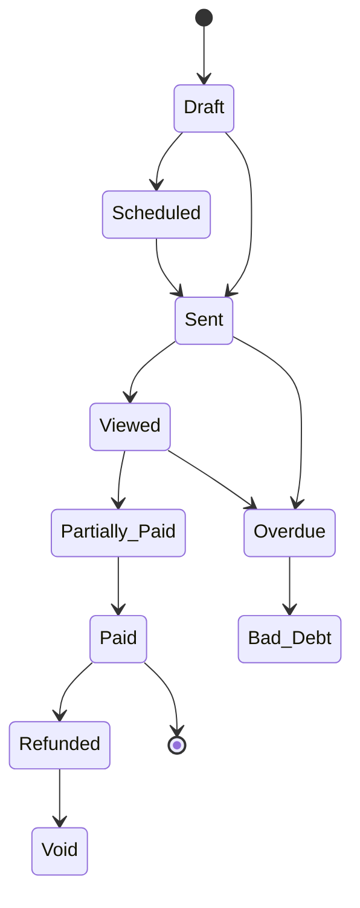

# Invoicing

Create professional invoices, track payments, set up recurring billing, issue credit notes, and monitor your agency's financial health.

---

## Creating an Invoice

Navigate to **Invoices** in the sidebar and click **"New Invoice"**.

### Invoice Fields

| Field | Description |
|-------|-------------|
| **Invoice Number** | Auto-generated sequentially (e.g., INV-00001). Prefix, padding, and counter are configurable in agency settings |
| **Client** | The client organization being billed |
| **Project** | Optionally link to a project |
| **Issue Date** | Date the invoice is created (defaults to today) |
| **Due Date** | Payment deadline |
| **Payment Terms** | Terms text (e.g., "Net 30") — selecting terms auto-calculates the due date |
| **Currency** | Invoice currency (defaults to your agency's default) |
| **Notes** | Client-facing notes |
| **Internal Notes** | Agency-only notes (not visible to clients) |

### Invoice Defaults

Configure default values for new invoices under **Settings → Branding → Invoices**:

| Setting | Description |
|---------|-------------|
| **Invoice Prefix** | Prefix for numbering (e.g., "INV", "PRJ") |
| **Counter Padding** | Zero-padding width (3–8 digits) |
| **Default Payment Terms** | Terms applied to new invoices |
| **Default Tax Rate** | Tax rate applied to new invoices |
| **Tax Label** | Label for the tax line (e.g., "GST", "VAT", "Tax") |
| **Late Fee Policy** | Display-only late fee policy text |

### Line Items

Each invoice contains line items with:

| Field | Description |
|-------|-------------|
| **Type** | One-Time, Recurring, Usage-Based, Discount, Tax, or Credit |
| **Name & Description** | What you're billing for |
| **Quantity** | Number of units |
| **Unit Price** | Price per unit |
| **Discount** | Per-line discount (percentage or fixed amount) |
| **Tax Rate** | Per-line tax percentage |
| **Service Link** | Optionally link to a service from your catalog |

Line totals are calculated automatically: `(Quantity × Unit Price − Discount) × (1 + Tax Rate)`.

Line items support **drag-and-drop reorder** to arrange them in your preferred order. Invoice-level discounts and tax rates can also be applied to the entire invoice.

### Live Preview

As you fill in the invoice form, a **real-time preview** panel shows exactly what the final invoice will look like. The preview uses an **A4 aspect ratio** and updates instantly as you type — including line items, totals, discounts, tax, and your agency branding (logo, accent color, footer).

The same split-panel layout is used for both creating and editing invoices.

### Frozen Billing Snapshot

When an invoice is sent, the client's billing details (name, email, company, address) are **frozen** onto the invoice. This ensures the invoice always reflects the correct billing info at the time it was issued — even if the client's details are updated later.

---

## Invoice Statuses

Invoices flow through the following lifecycle:

| Status | Meaning |
|--------|---------|
| **Draft** | Still being prepared — only drafts can be deleted |
| **Scheduled** | Set to send automatically on a future date |
| **Sent** | Delivered to the client |
| **Viewed** | The client has opened the invoice (auto-detected) |
| **Partially Paid** | Some payment has been received |
| **Paid** | Fully paid |
| **Overdue** | Past due date without full payment |
| **Bad Debt** | Marked as uncollectable |
| **Void** | Cancelled / invalidated |
| **Refunded** | Payment has been fully refunded |

When a client portal user views an invoice, the status automatically transitions from **Sent** to **Viewed** — the invoice creator and agency owners are notified.

### Role-Aware Status Labels

Client portal users see "**Received**" instead of "Sent" for invoices — making the label contextual to their perspective. All other statuses display the same label for both sides.

---

## Sending Invoices

Once an invoice is ready, click **"Send"** to deliver it to the client's contacts. You can also:

- **Schedule** an invoice for future delivery
- **Share via public link** — generate a shareable URL for clients to view and pay the invoice without logging in

When an invoice is sent:
- All contacts linked to the client organization receive a notification
- A **branded PDF** of the invoice is attached to the email automatically
- The invoice uses your agency's branding (logo, accent color, footer, signature)

### Public Payment Link

Each invoice gets a unique public link that clients can use to view the invoice and pay via Stripe — without needing a portal login. The public page displays:

- Full invoice details with line items and totals
- Your agency logo and branding
- A **"Pay"** button (when Stripe is connected and the invoice isn't already paid or voided)
- Partial payment support (when enabled)

---

## Partial Payments

Allow clients to pay a portion of an invoice via Stripe:

1. Enable **"Allow Partial Payment"** when creating or editing an invoice
2. Set the **minimum payment percentage** (default: 25%)
3. Clients see an amount input on the payment page with min/max constraints
4. Each partial payment transitions the invoice to **Partially Paid**
5. Recurring invoice templates inherit these settings automatically

Agency-side "Record Payment" allows any positive amount regardless of the partial payment toggle — the minimum percentage only applies to client-side Stripe payments.

---

## Generate Invoice from Time Entries

Create invoices directly from tracked time on a project's **Budget & Time** tab:

On the Budget & Time tab, click **"Generate Invoice"** (shows unbilled entry count)

Select date range, grouping (Per Task, Per Member, or Single Line), and hourly rate

See matching entry count, total hours, and estimated total

Creates a DRAFT invoice, links all matching entries, and redirects to the invoice

Linked time entries are automatically displayed on the invoice detail page. Deleting the draft invoice unlocks the entries so they can be re-billed.

> **See also:** [Contracts & Services](../clients/contracts#time--billing) for organization-level time billing across all projects

---

## Edit Lock

Once an invoice is **fully paid**, it becomes read-only — you cannot edit invoice details or line items. Internal notes can still be updated. To modify a paid invoice, issue a credit note or refund instead.

---

## Duplicate & Delete

- **Duplicate** any invoice to create a copy with a new invoice number
- **Delete** is only available for Draft invoices — once sent, invoices must be voided instead
- **Void** requires a reason (e.g., "Duplicate", "Issued in error") — tracked in the invoice history
- **Bad Debt** also requires a reason — marks the invoice as uncollectable for reporting purposes

---

## Permissions

| Permission | What It Allows |
|-----------|---------------|
| **View Invoices** | List, view details, see statistics and analytics |
| **Create Invoices** | Create new invoices and duplicates |
| **Edit Invoices** | Update invoice details and line items |
| **Send Invoices** | Send invoices to clients |
| **Void Invoices** | Void an invoice |
| **Delete Invoices** | Delete draft invoices |
| **Record Payments** | Record and delete payments, apply credit notes |
| **Mark Bad Debt** | Mark invoices as uncollectable |
| **Issue Refunds** | Issue refunds and create credit notes |

Use custom roles to fine-tune invoice permissions for your team. For example, give Project Managers **View** access but restrict **Send** and **Record Payments** to Owners and Accountants.

---

## Related

Record payments, issue credit notes, and process refunds.

Automate billing with scheduled invoice generation.

Track financial metrics and customize invoice appearance.

---

## Invoice Branding

Invoices are automatically branded with your agency's settings:

- **Invoice logo** — Custom logo or your main logo
- **Accent color** — Applied to the "INVOICE" label and total amount
- **Footer note** — Legal footer text
- **Bank details** — Bank transfer payment details
- **Payment instructions** — How to pay
- **Signature** — Optional signature image
- **Business registration** — Registration or tax ID display

### Print Settings

| Setting | Options |
|---------|---------| 
| **Show Logo** | Yes / No |
| **Show Payment History** | Yes / No |
| **Show Bank Details** | Yes / No |
| **Show Notes** | Yes / No |
| **Paper Size** | A4 or Letter |

> **See also:** [Settings](../settings/branding#agency-branding) for configuring invoice branding

---

## Invoice Timeline

Every invoice has a unified **timeline** that shows all activity in chronological order:

- Audit events (created, edited, sent, voided)
- Payment recordings and deletions
- Refund events
- Credit note issued and applied events
- Reminder sends (with delivery status)

View the timeline from the invoice detail page to see a complete history of the invoice's lifecycle.

---

## Visibility Controls

Control which team members can see specific invoices. By default, invoices are visible to all authorized users. Add visibility restrictions to limit access to sensitive invoices.

---

## Comments

Leave comments on invoices for team discussion:

- **Internal comments** — only visible to agency staff, useful for discussing pricing or payment issues
- **Standard comments** — visible to anyone with access to the invoice
- Supports threaded replies, @mentions, and emoji reactions
- Comments appear in the invoice detail view

---

## Finance Analytics Dashboard

The **Analytics** tab on the Invoices page provides a comprehensive financial overview.

| Metric | What It Shows |
|--------|--------------|
| **Outstanding Amount** | Total unpaid across all invoices |
| **Overdue Amount** | Unpaid invoices past their due date |
| **This Month's Revenue** | Payments received this month |
| **Total Revenue** | All-time revenue from paid invoices |
| **Collection Rate** | Percentage of issued invoices that were collected |
| **Average Days to Payment** | Mean time from issue to payment |
| **Average Days Late** | Mean time past due for late payers |
| **MRR / ARR** | Monthly and yearly recurring revenue from recurring templates |
| **Aging Buckets** | Overdue amounts grouped: 0-30, 31-60, 61-90, 90+ days |
| **Revenue by Client** | Top 5 clients by revenue |
| **Revenue Forecast** | Expected revenue for next 30/60/90 days |
| **Status Counts** | Breakdown by invoice status |

Organization Owners see a simplified 4-card analytics view:

| Card | What It Shows |
|------|--------------|
| **Outstanding Balance** | Current unpaid invoice total |
| **Overdue** | Overdue invoice amount |
| **Total Paid** | All-time payment total |
| **Avg Days to Pay** | Average time to payment |

The full analytics dashboard is only visible to agency staff with financial access. Project Managers and Team Members see a restricted view without dollar amounts.

### Sidebar Badge

An **unpaid invoice count badge** appears on the Invoices sidebar link for client portal users, showing the number of outstanding invoices (Sent, Viewed, Partially Paid, or Overdue).

Use the aging buckets to proactively follow up on overdue invoices before they hit the 90+ day mark — where collection rates drop significantly.

---

## Related

Additional revenue, client, and project analytics.

Per-client financial tracking and billing history.

---

## Recording Payments

Record payments on any sent invoice:

| Field | Description |
|-------|-------------|
| **Amount** | Payment amount |
| **Method** | Manual, Bank Transfer, Stripe, PayPal, Cash, Wise, or Other |
| **Reference** | External reference (check number, wire reference, etc.) |
| **Date** | When the payment was received |
| **Notes** | Payment notes |

When a payment is recorded:
- If the paid amount equals or exceeds the total → status changes to **Paid**
- If partial payment → status changes to **Partially Paid**
- Client contacts are notified automatically

### Stripe Payments

Clients can pay invoices online via Stripe through the invoice's public share link or from their portal. For invoices linked to proposals with recurring services, the payment method is saved automatically for future auto-renewal.

---

## Invoice Reminders

Set up automated payment reminders:

| Reminder Type | When It Sends |
|--------------|--------------| 
| **Before Due** | X days before the due date |
| **On Due Date** | The day payment is due |
| **After Due** | X days after the due date (for overdue invoices) |

Each reminder can have a custom message. Delivery is tracked so you can see when reminders were sent.

Additionally, the platform automatically sends a **payment reminder** to client contacts when an invoice is due within 3 days.

---

## Credit Notes

Issue credit notes against invoices when refunds or adjustments are needed:

- Credit notes are numbered automatically (e.g., CN-00001)
- Each credit note tracks a **remaining balance**
- Apply credit notes as payment to any invoice — the credit's balance is reduced and the invoice's paid amount is increased
- Credits can be applied in full or partially

### Issuing a Credit Note

On the invoice detail page, click **"Credit Note"** to issue a credit against the invoice. Enter the credit amount and an optional reason.

### Applying a Credit

Click **"Apply Credit"** on any invoice with an outstanding balance to apply an existing credit note's balance as payment.

Credit notes are available on **Pro** plans and above.

---

## Refunds

Issue refunds against specific payments or entire invoices:

The refund amount is validated against the paid amount

The invoice's paid amount is decreased

If fully refunded, the invoice status changes to **Refunded**

Stripe refunds are processed automatically for online payments

Refund statuses: Pending → Processed / Failed.

---

## Action Bar

The invoice detail page shows action buttons based on your role and the invoice's current status:

| Action | When Available | Required Permission |
|--------|---------------|:-------------------:|
| **Edit** | Not Void or Bad Debt | Edit Invoices |
| **Send** | Draft or Scheduled | Send Invoices |
| **Record Payment** | Unpaid invoices | Record Payments |
| **Refund** | Paid or Partially Paid | Issue Refunds |
| **Credit Note** | Non-terminal statuses | Issue Refunds or Record Payments |
| **Apply Credit** | When balance is due | Record Payments |
| **Bad Debt** | Non-terminal, unpaid | Mark Bad Debt |
| **Void** | Non-terminal, not paid | Void Invoices |
| **Delete** | Draft only | Delete Invoices |

Buttons that you don't have permission for are hidden — you'll never see a button that would fail when clicked.

---

---

## Recurring Invoices

Set up automatic invoice generation on a schedule:

| Setting | Description |
|---------|-------------|
| **Name** | Template name for reference |
| **Frequency** | Weekly, Monthly, Quarterly, or Yearly |
| **Start Date** | When to begin generating invoices |
| **End Date** | When to stop (optional) |
| **Lead Days** | Generate the invoice X days before it's due (default: 5) |
| **Auto-Generate** | Automatically create the invoice |
| **Auto-Send** | Automatically send after generation |
| **Auto-Charge** | Automatically charge via Stripe (requires saved payment method) |
| **Partial Payment** | Allow partial payments on generated invoices (inherits to each invoice) |
| **Template Items** | Pre-configured line items for each generated invoice |

### Managing Recurring Templates

The **Recurring** tab on the Invoices page provides a management interface:

| Column | What It Shows |
|--------|--------------|
| **Invoice** | Template name (links to detail page) |
| **Client** | Client organization |
| **Status** | Active / Paused toggle |
| **Frequency** | Color-coded pill (Weekly, Monthly, Quarterly, Yearly) |
| **Next Due** | Next generation date (highlighted if overdue) |
| **Generated** | Number of invoices generated from this template |
| **Created By** | Who created the template |

### Template Detail Page

Each recurring template has a detail page showing:

- Template metadata and automation settings (auto-generate, auto-send, auto-charge indicators)
- Line items table with totals
- Generation history sidebar showing the last 20 generated invoices
- Actions: Toggle Active/Pause, Generate Now, Delete

Recurring templates can be activated, paused, or deleted at any time. Force-generate an invoice from any template at any time.

The Recurring tab is only visible to agency staff — client portal users do not see it.

---

## MRR & ARR

Monthly Recurring Revenue (MRR) and Annual Recurring Revenue (ARR) are calculated from active recurring templates using frequency multipliers:

| Frequency | MRR Multiplier |
|-----------|:--------------:|
| Weekly | × 4.33 |
| Monthly | × 1 |
| Quarterly | × 0.33 |
| Yearly | × 0.083 |

MRR and ARR appear in the invoice analytics dashboard.

---

## Usage Breakdown (Time-Based Invoices)

For invoices linked to hourly or usage-based services, the invoice detail page shows a **per-entry breakdown** table:

| Column | What It Shows |
|--------|--------------| 
| **Date** | When the time was logged |
| **Task** | Which task the entry relates to (linked) |
| **Regular Minutes** | Time within the included hours balance |
| **Overtime Minutes** | Time beyond the included hours |
| **Regular Rate** | The regular hourly rate at the time of logging |
| **Overtime Rate** | The overtime rate at the time of logging |

Rates are **snapshotted** when time is logged — the invoice reflects the exact rate that applied at that moment, not the current service rate. Written-off entries (agency comp) are excluded from the breakdown.

---
