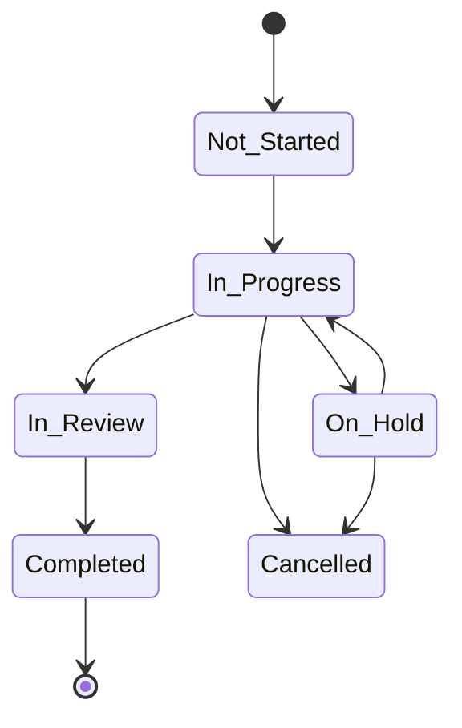

# Projects

Projects are the central way to organize work for your clients. Each project can contain tasks, milestones, documents, files, and time entries.

---

## Creating a Project

To create a project, navigate to **Projects** in the sidebar and click **"New Project"**.

### Project Details

| Field | Description |
|-------|-------------|
| **Name** | A descriptive project name (a URL-friendly slug is auto-generated) |
| **Description** | Rich text description of the project scope |
| **Client** | The client organization this project belongs to |
| **Status** | Current phase (defaults to Not Started) |
| **Priority** | Low, Medium, High, or Urgent |
| **Start Date / Due Date** | Planned timeline |
| **Service** | Optionally link to a service from your catalog |
| **Internal Notes** | Agency-only notes (not visible to client users) |

### Project Statuses

Projects follow a standard lifecycle:

---

## Project Budget

Each project can have a budget to track spending:

| Budget Type | How It Works |
|------------|-------------|
| **Fixed** | A set total budget amount |
| **Hourly** | Budget based on total hours × rate |
| **Retainer** | Recurring budget arrangement |

When budget utilization reaches **80% or more**, the agency Owner is automatically notified.

### Generate Invoice from Time Entries

On the **Budget & Time** tab of any project, agency staff with invoicing permissions can manually generate an invoice from unbilled time entries:

Click **"Generate Invoice"** to open the invoice generation modal

Select a **date range** to filter time entries

Choose a **grouping style** (by task, by team member, or flat list) and set the hourly rate

Review the line items and total, then click **Generate** to create a **draft invoice** and be redirected to the invoice detail page

Only billable, completed time entries that haven't already been invoiced are included. Written-off entries are excluded.

> **See also:** [Reports](./reports) for budget tracking across all projects

---

## Project Health

Project health is calculated automatically based on task progress, overdue items, and deadline proximity:

| Health | Meaning |
|--------|---------|
| ● **On Track** | Tasks are on pace, no red flags |
| ● **At Risk** | More than 20% overdue tasks, or deadline approaching with low completion |
| ● **Off Track** | More than 40% overdue tasks, or project is past deadline |

Health status appears on the project list page and the executive dashboard.

---

## Project Team Members

Add team members to a project under the **Members** tab. Each member has a specific role:

| Role | What They Can Do |
|------|-----------------|
| **Lead** | Full project management — edit project details, manage members, all task operations |
| **Member** | Work on tasks, log time, upload files, add comments |
| **Viewer** | Read-only access to project data |

Each user can have only one role per project. When members are added or removed, they receive a notification.

---

## Milestones

Milestones mark key deliverables or checkpoints within a project. You can:

- Create milestones with names and target dates
- Assign tasks to specific milestones
- Track milestone completion

When a milestone is completed, all project members are notified.

> **See also:** [Notifications](./notifications/overview) for milestone and project notifications

---

## Project Documents

Create rich text documents directly within a project (e.g., briefs, meeting notes, specifications).

- Documents can be **pinned** to appear at the top of the list
- Requires the **Manage Docs** permission
- Intake form submissions are automatically saved as pinned documents in the project

---

## Comments

Leave comments directly on a project to discuss scope, share updates, or ask questions.

- **Internal comments** are only visible to agency staff — not visible to client portal users
- **Standard comments** are visible to everyone with access to the project
- Comment threads support replies and @mentions
- React to comments with emojis for quick feedback

---

## Project Files

Upload files to a project for easy sharing with the team. Files can also be attached to specific tasks.

- Drag and drop upload supported
- Files are stored securely and scoped to the project
- **Pinned files** appear on the project overview
- Project members are notified when files are uploaded

> **See also:** [File Management](./files) for the agency-wide file browser and storage limits

---

## Time Tracking

Log time directly on a project or on individual tasks within it.

| Feature | Description |
|---------|-------------|
| **Duration** | Time in minutes |
| **Time range** | Optional start/end timestamps |
| **Description** | What you worked on |
| **Billable flag** | Mark time entries as billable or non-billable |
| **Task link** | Optionally link to a specific task |
| **Client service link** | Link to a client's service assignment for balance tracking |

Time entry statistics are aggregated per project and per task, showing:
- Total logged hours
- Billable vs. non-billable split
- Remaining hours against estimated effort

### Start Timer from Project

You can start a live timer directly from the project page header using the **Start Timer** button. This works the same as the task-level timer — you can pause, resume, and stop it at any time. When stopped, the elapsed time is saved as a time entry on the project. If a timer is already running on a task within the project, the button shows the active timer instead.

When time is logged on a task by someone other than the assignee, the assignee is notified.

> **See also:** [Tasks](./tasks/overview) for the task-level timer · [Services](./services/pricing#hours--credits-tracking) for prepaid hour deductions · [Reports](./reports) for time tracking reports

---

## Activity Log

Every significant action on a project is recorded in an activity log, including:

- Project creation and updates
- Member additions and removals
- Milestone changes
- File uploads
- Task changes

This provides a full history of what happened and who did it.

---

## Project Tabs

Project detail pages are organized into tabs for quick navigation:

| Tab | What It Contains |
|-----|-----------------|
| **Overview** | Project details, health, budget progress, key metrics, and pinned files/documents |
| **Tasks** | Full task board (Kanban, List, or Workload view) with filters and analytics |
| **Milestones** | Milestone list with status, owner, and linked tasks |
| **Files** | Uploaded project files with drag-and-drop upload |
| **Comments** | Project-level discussion with internal/standard visibility |
| **Activity** | Full activity log for all project events |

---

## Project Templates

Save time on repetitive project setups with **project templates**. A template captures the structure of a project — milestones, tasks, and checklists — so you can reuse it when creating new projects.

### Creating Templates

Go to **Settings → Agency → Templates** to manage your project templates.

| Method | How |
|--------|-----|
| **From scratch** | Define milestones, tasks, and checklists manually |
| **From existing project** | Click **"Save as Template"** on any project to capture its current structure |

### Template Structure

Each template can include:

- **Milestones** — key project phases
- **Tasks** — pre-configured with title, description, priority, and sort order
- **Checklist items** — per-task checklists for detailed work breakdowns
- **Default settings** — priority, budget type, and budget amount

### Using Templates

When creating a new project, select a template from the **Template** dropdown. The project is automatically populated with the template's milestones, tasks, and checklists.

Project Templates is a **Pro plan** feature. Free plan users can browse templates but cannot create new ones.

> **See also:** [Services](./services/overview#service-templates) for service-level project scaffolding

---

## Auto-Created Projects

Projects can be automatically created when a client purchases a service through the catalog checkout. These projects:

- Are named after the purchased service
- Have the agency Owner assigned as project Lead
- Are linked to the client's service assignment
- Show a source badge indicating they were created from a service purchase

> **See also:** [Services](./services/catalog#cart--checkout-flow) for the purchase flow · [Client Portal](./client-portal/overview) for what clients see after purchasing
