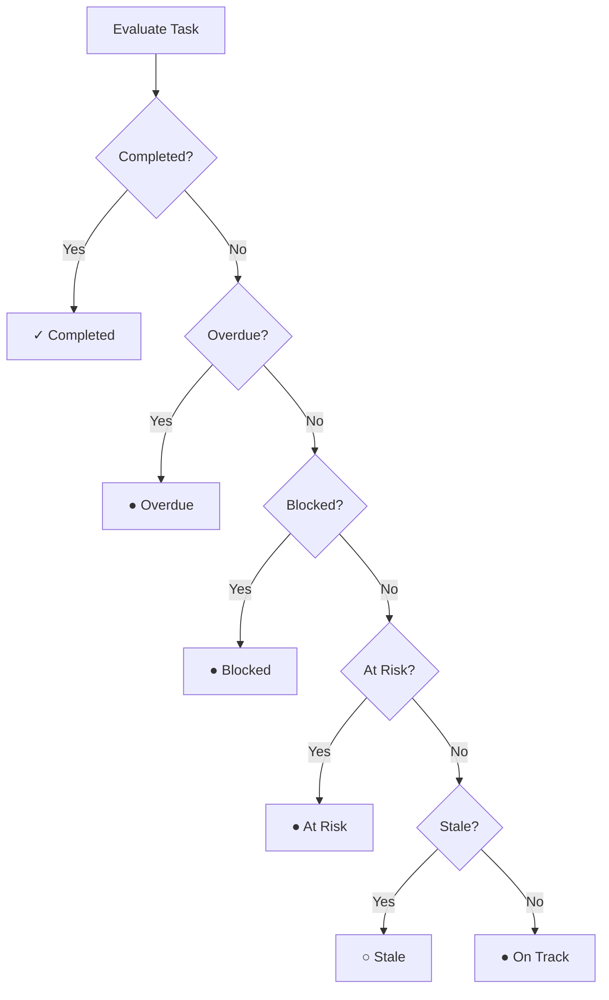

# Tasks

Tasks are the building blocks of project work. Assign them to team members, organize them with labels and checklists, track time, and collaborate through comments.

---

## Task Views

Tasks can be viewed in multiple ways:

| View | Best For |
|------|----------|
| **Kanban Board** | Visual workflow — drag and drop tasks between status columns |
| **List View** | Detailed table with sorting, filtering, and drag-and-drop between status groups |
| **Workload View** | See task distribution, capacity levels, and overdue counts per team member |

Switch between views using the view toggle at the top of the tasks page. Your selected view persists via the URL — refreshing the page keeps you on the same view.

### Column Settings (List View)

In List view, click the **⚙ Columns** button to choose which columns are visible. Toggle columns on or off to customize your view:

- Title (always visible)
- Priority, Health, Assignee, Due Date, Created, Updated, Project

Your column preferences are saved per browser and shared across the global Tasks page and project task lists.

### Task Analytics Strip

Above the task list, a quick-reference analytics strip shows:

| Metric | What It Shows |
|--------|--------------|
| **Active** | Total active tasks (not Done) |
| **Overdue** | Tasks past their due date |
| **Due Today** | Tasks due today |
| **Due This Week** | Tasks due within 7 days |
| **Completed This Week** | Tasks marked Done in the last 7 days |
| **Avg. Completion Time** | Average time from created to Done |
| **Completion Rate** | Percentage of all-time tasks that are Done |

---

## Creating & Editing Tasks

### Task Fields

| Field | Description |
|-------|-------------|
| **Title** | Short, descriptive name |
| **Description** | Rich text details and context |
| **Status** | To Do, In Progress, In Review, Done |
| **Priority** | Low, Medium, High, Urgent |
| **Assignee** | Who is responsible for this task |
| **Project** | Which project this task belongs to |
| **Milestone** | Optional milestone within the project |
| **Due Date** | When the task is due |
| **Estimated Hours** | Planned effort |
| **Labels** | Color-coded tags for categorization |
| **Tags** | Free-form text tags for flexible categorization beyond labels |
| **Complexity** | Optional complexity score for estimation and prioritization |
| **Billable** | Whether time logged on this task counts as billable (default: yes) |

### Deferred Task Creation

When you click **"+ New Task"**, a title input appears first — the task is only created in the database after you provide a real title and press `Enter`. Press `Escape` to cancel without creating anything.

### Task Drawer

Click any task to open the **Task Drawer** — a slide-out panel for editing all task details, viewing comments, attachments, checklists, time entries, and the activity log.

### Activity Log

Every task keeps a detailed **activity log** showing all changes: creation, status changes, comments, time entries, reassignments, and more. Each entry records who made the change and when. View the log in the Activity tab of the task drawer.

---

## Task Statuses

By default, tasks flow through four statuses:

| Status | Meaning |
|--------|---------|
| **To Do** | Not yet started |
| **In Progress** | Actively being worked on |
| **In Review** | Completed work awaiting review |
| **Done** | Finished |

Drag tasks between columns on the Kanban board, or change the status dropdown in the task drawer.

### Custom Statuses

Each project can define its own task statuses to match your workflow. Click the **gear icon** on the project's task board to open the Status Manager, where you can:

- **Create** new statuses with a custom name and color
- **Rename** existing statuses
- **Reorder** statuses via drag-and-drop (this changes the column order on the Kanban board)
- **Delete** statuses — you'll be prompted to reassign any tasks using that status
- **Mark as closed** — closed statuses (like "Done") indicate completed work

New projects are automatically seeded with the four default statuses. Custom statuses are scoped per project — they don't affect other projects.

---

## Sections & Lists

Organize tasks within a project using a **Section → List** hierarchy. Sections act as folders, and each list contains its own group of tasks with an independent status pipeline.

```
Project
├── Section (folder)
│   ├── List
│   │   ├── Task
│   │   └── Task
│   └── List
├── List (top-level, no section)
└── Tasks (project root — no list)
```

### Key Concepts

| Concept | Description |
|---------|-------------|
| **Sections** | Folders that group related lists. Strictly flat — no nested sections. Deleting a section moves its lists to the top level. |
| **Lists** | Each list has its own tasks and an independent status pipeline. Deleting a list moves its tasks to the project root. |
| **Project Root** | Tasks with no list assignment appear in the "All Tasks" view. |

### List-Specific Status Pipelines

Each list gets its own set of task statuses, copied from the project's statuses when the list is created. This means different lists can have completely different workflows:

- **Design List** → Concept → Wireframe → Review → Approved
- **Development List** → Backlog → In Progress → Testing → Done

### Cross-List Task Moves

When you move a task between lists, if its current status doesn't exist in the destination list, it's automatically **remapped to the default status** of the new list.

### Sidebar Navigation

The project sidebar shows a collapsible tree of Sections → Lists:

- **Create** sections and lists inline from the sidebar
- **Rename or delete** via right-click context menu
- **Reorder** sections and lists with drag-and-drop
- **Move lists between sections** by dragging a list onto a different section header
- **Collapsed mode** — icon-only sidebar rail (56px) with tooltips for compact navigation
- **Mobile** — slide-over sheet on small screens

### URL Deep Linking

Selecting a list sets `?list={listId}` in the URL. Links are bookmarkable and shareable — opening the link auto-switches to the Tasks tab with the correct list selected.

### Grouping Options

In the "All Tasks" view (no specific list selected), you can toggle **Group by: Status or List** in the filter bar. This groups your tasks by their parent list instead of status, giving you a cross-list overview.

Lists are gated by your plan. Each plan defines a maximum number of lists per project (default: 3). Existing projects without lists continue to work unchanged.

---

## Labels

Create color-coded **labels** to categorize tasks across projects:

- Labels are shared across your workspace
- Assign multiple labels to a single task
- Filter tasks by label in both list and Kanban views

> **See also:** [Keyboard Shortcuts](../keyboard-shortcuts#tasks-page) for task keyboard shortcuts

---

---

## Time Tracking

### Live Timer

Start a timer directly from the task drawer. The timer runs until you stop it, at which point a time entry is automatically created.

### Manual Entry

Log time manually by entering the duration, description, and optionally marking it as billable.

For **usage-based** service projects, an **"⏱ Overtime"** checkbox lets you explicitly mark entries as overtime hours.

Time logged on a task by someone other than the assignee triggers a notification to the assignee.

### Billed Entry Protection

Once a time entry is linked to an invoice (billed), it becomes **immutable** — it cannot be edited or deleted. Billed entries display a 🔒 lock icon.

Unbilled entries can be deleted, which automatically restores the consumed quota balance.

> **See also:** [Projects](../projects#time-tracking) for project-level time tracking · [Services](../services/pricing#hours--credits-tracking) for service hour deductions · [Reports](../reports) for time reports

---

## Comments & Collaboration

### Adding Comments

Leave comments on tasks to discuss work, ask questions, or share updates.

- **Internal comments** are only visible to agency staff (not visible to client users in the portal)
- **Standard comments** are visible to everyone with access to the task

### Threaded Replies

Reply directly to a comment to keep conversations organized in threads.

### @Mentions

Type `@` followed by a team member's name to mention them. They'll receive a notification linking directly to the comment.

### Reactions

React to comments with emojis for quick feedback — 👍, ❤️, 😂, 🎉, 🤔, 👀, 🚀, and more.

The comment author is notified when someone reacts to their comment.

> **See also:** [Notifications](../notifications/overview) for comment and mention notifications

---

## Task Sharing

Share a task externally using a **public share link** — anyone with the link can view the task details without logging in.

Toggle the share link on or off from the task drawer.

> **See also:** [Keyboard Shortcuts](../keyboard-shortcuts#task-drawer) for task keyboard shortcuts

---

---

## Task Health

Each task is automatically assessed for health based on its due date, dependencies, and activity:

| Indicator | Condition |
|-----------|-----------|
| ● **On Track** | On schedule, no issues |
| ● **At Risk** | Due within 2 days and still in To Do |
| ● **Overdue** | Past due date and not completed |
| ● **Blocked** | Waiting on a dependency that isn't done |
| ○ **Stale** | No updates for 3+ days while still active |
| ✓ **Completed** | Task is Done |

Health is evaluated in order of severity: Completed → Overdue → Blocked → At Risk → Stale → On Track.



Health indicators appear on the task card and in the task drawer.

---

## Subtasks

Break large tasks into smaller **subtasks**. Subtasks are full tasks linked to a parent task:

- Each subtask has its own status, assignee, and due date
- The parent task shows subtask completion progress
- When a subtask is marked Done, the parent task's assignee and creator are notified

---

## Checklists

Add a checklist to any task for a quick to-do list:

- Check off items as they're completed
- Checklist items support **nesting** — add sub-items under any checklist item for multi-level checklists
- A **checklist progress bar** shows the completion percentage on every task card
- When **all items** are checked, the task assignee and creator are notified
- Great for multi-step processes that don't need full subtasks

---

## Dependencies

Link related tasks with dependencies to define the order of work:

| Dependency Type | Meaning |
|----------------|---------|
| **Blocking** | This task must be completed before the linked task can start |
| **Blocked By** | This task is waiting on another task |

Dependencies help visualize the flow of work and identify bottlenecks.

A task cannot be marked as Done if it has unfinished dependencies. Complete the blocking tasks first.

---

## File Attachments

Attach files to tasks via the **📎 paperclip button** in the rich text editor toolbar (available in task descriptions and comments).

### Upload Process

Click the paperclip button or drag and drop files into the editor

Files are uploaded and automatically scanned for security threats

Images appear inline; other files appear as downloadable links

### Upload Limits

| Limit | Value |
|-------|-------|
| **Maximum file size** | 10 MB per file |
| **Allowed types** | Images (JPG, PNG, GIF, SVG, WebP), Documents (PDF, DOC, DOCX, TXT), Spreadsheets (XLS, XLSX, CSV), Media (MP4, MP3, WAV, WebM) |

### Progressive Upload Feedback

While uploading, a placeholder in the editor shows real-time progress:

| Phase | Message |
|-------|---------|
| **Uploading** | "Uploading {filename}..." |
| **Scanning** | "Scanning {filename} for security..." |
| **Long scan** | "Still scanning {filename}... almost done" |

All uploaded files are accessible in the **Attachments tab** of the task drawer. Project members can view and download all task attachments.

---

---

## Task Visibility

Control who can see specific tasks using four visibility levels:

| Visibility | Who Can See |
|-----------|-------------|
| **Organization** (default) | Everyone in the workspace |
| **Project** | Only members of the task's project |
| **Team** | Specific users you grant access to, plus project members |
| **Private** | Only specific users you explicitly grant access to |

Set the visibility level in the task drawer. For Team and Private visibility, add individual users to the access list.

Client users (Organization Owner/Member) always see only tasks in their organization's projects, regardless of the visibility setting.

---

## Assignee Rules

The assignee dropdown shows different people depending on context:

| Context | Who Appears |
|---------|------------|
| Task inside a project | Project team members + Agency Owner |
| Task without a project | All agency staff + Agency Owner |

Client users (Organization Owner / Organization Member) **cannot be assigned tasks** — only agency staff appear in the assignee dropdown.

---

## Notifications

You'll receive automatic notifications for key task events:

| Event | Who Gets Notified |
|-------|------------------|
| Task assigned to you | Assignee |
| Task status changed | Assignee + creator (excludes the person who made the change) |
| New comment on your task | Assignee |
| Reply to your comment | Comment author |
| Reaction on your comment | Comment author |
| @mentioned in a comment | Mentioned user |
| Task due tomorrow | Assignee |
| Sub-task completed | Parent task assignee + creator |
| All checklist items completed | Task assignee + creator |

> **See also:** [Notifications](../notifications/overview) for setting up preferences and digest frequency · [Automations](../automations) for automating task actions
